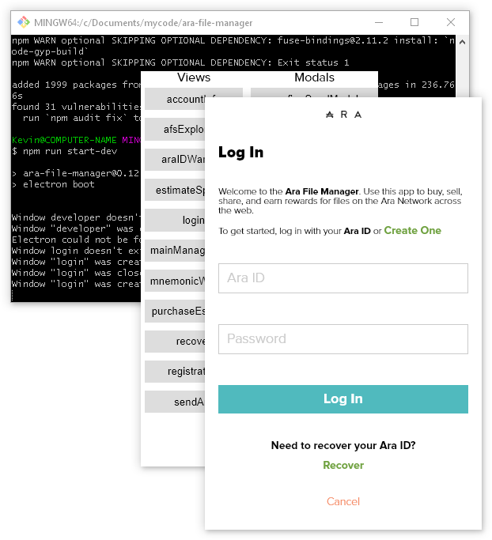

# Building Ara

The Ara File Manager includes Node modules developed within
[Ara Blocks](https://github.com/arablocks),
[Dat](https://dat.foundation/) and
[Ethereum](https://www.ethereum.org/).
Building the Ara File Manager includes building native modules, including [web3](https://www.npmjs.com/package/web3) and the _Ethereum Virtual Machine_.
This guide will help you get your computer setup to build the Ara modules and the Ara File Manager.

## Cheat sheet

If you've been through this guide before, here are the commands in quick summary:

```
$ nave use 8.17.0           nave is macOS only
$ exit                      get out of nave when you're all done

$ git --version             make sure you can reach everything
$ gcc --version             macOS only, Visual Studio will build native modules on Windows
$ node --version            we recommend 8.17.0
$ npm --version
$ node-gyp --version
$ electron --version
$ electron                  and try running global Electron

$ git clone https://github.com/arablocks/ara-file-manager  
$ cd ara-file-manager
$ npm install
$ npm run start             run from code

$ npm run dir               make a .app folder on macOS, and an .exe file on Windows
$ npm run mac               run the .app from the command line to see console output
$ npm run win               run the .exe from the command line to see console output
$ npm run build             same as dir, but keeps going to make the dmg and setup.exe

$ npm run clean             delete stuff to start over with $ npm run build
$ npm run power-wash        delete stuff to start over with $ npm install
$ npm run uninstall         delete stuff to start over with opening the dmg or running setup.exe
```

As of this writing, on macOS, we're building with
**Node 8.17.0**,
**npm 6.13.4**, and
**node-gyp 5.0.3**.
* **Clone** takes **10s** to make **300 files** and **170 MB**.
* **Install** takes **4m40s** to make **39k files** and **820 MB**.
* **Build** takes **7m32s** to make **39k files** and **1.4 GB**.
* The dist folder has a **100 MB dmg**.

On Windows, we're building with
**Node 8.17.0**,
**npm 6.13.4**, and
**node-gyp 5.0.3**.
* **Clone** takes **3s** to make **300 files** and **160 MB**.
* **Install** takes **3m45s** to make **35k files** and **830 MB**.
* **Build** takes **3m5s** to make **36k files** and **1.3 GB**.
* The dist folder has a **50 MB exe**.

Steps to increment the version number and tag a new release:

```
$ git clone https://github.com/arablocks/ara-file-manager
$ cd ara-file-manager
$ npm install
$ npm version patch         major, minor, or patch
$ git push
$ git push --tags
```

Steps to build a release:

```
win, make sure the .pfx file is where you clone if you want to code sign:
$ git clone https://github.com/arablocks/ara-file-manager
$ cd ara-file-manager
$ git checkout tags/1.2.3
$ npm install
$ npm run build

mac:
$ nave use 8.17.0
$ git clone https://github.com/arablocks/ara-file-manager
$ cd ara-file-manager
$ git checkout tags/1.2.3
$ npm install
$ APPLEID=you@example.com PASSWORD=yourpassword npm run build
$ exit

github website:
Code, Releases, Draft a new release
Tag version, type in 1.2.3, Existing tag
drag files from dist folder to webpage target area, Publish release
on mac, github website, Edit, drag in more files, Update release
```

Steps to make a branch and submit a pull request:

```
$ git clone https://github.com/arablocks/ara-file-manager
$ cd ara-file-manager
$ git pull
$ git checkout -b branch-name
$ git push --set-upstream origin branch-name    desktop to github
$ git checkout --track origin/branch-name       github to laptop, to test on mac, for instance

$ git pull
$ git status
$ git diff
$ git add .
$ git commit -a -n -m "intermediate note"
$ git commit -a -n -m "tasktype(file.ext): note about what you did"
$ git push

github website:
Rebase and merge, or Squash and merge
Delete branch
```

## Delete paths

If you've previously installed the Ara File Manager, you may want to start out again on a system that is free of remnants of previous attempts.
You can use `npm run uninstall`, or delete paths manually.
Using the generic user name *Kevin* as an example, on macOS, delete the files and directories at paths like these:

```
/Applications/Ara File Manager.app
~/.ara
~/.ararc
~/Library/Application Support/Ara File Manager
~/Library/Preferences/com.ara.one.araFileManager.helper.plist
~/Library/Preferences/com.ara.one.araFileManager.plist
```

And these on Windows:

```
~/.ara
~/.ararc
~/AppData/Local/ara-file-manager
~/AppData/Local/ara-updater
~/AppData/Local/Programs/ara
~/AppData/Roaming/Ara File Manager
```

Additionally, if you coded a sample app in Electron, it may have left some settings here:

```
~/AppData/Roaming/some-electron-sample-name
```

## Windows Update (Windows)

The Ara File Manager runs great in both Windows 7 and Windows 10.
It may be possible to build it in Windows 7, but the Windows trail in this guide assumes you've got 64-bit Windows 10.

Windows 10 likes to download and install updates in the background, and reboot your computer when it needs to.
If Windows Update is installing something right now, installing the Visual Studio build tools can fail.
So before we do that, it's best to make sure Windows Update is caught up and paused.

Click *Start*, *Settings*, **Update and Security**, and **Windows Update** to get to the settings.
Click **Check for Updates** to download and install updates.
Keep rebooting and checking for more until settings says *You're up to date*:


Then, click **Advanced options**, and under **Pause updates** flip the switch to **On**.
Now the update settings will look like this:


## Get a text editor

Download and install a text editor if you don't have one already.
You'll use it to view and edit JavaScript code and configuration files.
[Atom](https://atom.io/) is a great free, open source, and cross-platform editor.

A lighter-weight choice for Windows is [Notepad++](https://notepad-plus-plus.org/).
While not open source, [Sublime Text](https://www.sublimetext.com/), is also a favorite in the Ara team.

## Install Xcode to get Git and gcc (macOS)

[Git](https://en.wikipedia.org/wiki/Git) is the command line program we'll use to move source code between your computer and [github.com](https://github.com/).
The social open source coding website GitHub is named after Git, but they're two different things that can be used independently.

On macOS, run **Terminal**, and type:

```
$ git --version
```

The first time you ask for Git, your computer may open a dialog box that asks if you want to install [Xcode](https://en.wikipedia.org/wiki/Xcode) from the App Store, or just get the command line development tools.
The command line tools include Git, but we need all of Xcode to build the native Node modules Ara needs.
So, go into the **App Store** and install [Xcode](https://apps.apple.com/us/app/xcode/id497799835).
Several gigabytes and reboots later, head back to Terminal to check the version again:

```
$ git --version
git version 2.21.0 (Apple Git-122.2)

$ gcc --version
...
Apple clang version 11.0.0 (clang-1100.0.33.16)
```

Your Mac now has [gcc](https://en.wikipedia.org/wiki/GNU_Compiler_Collection), the C compiler that will build the native modules.

We won't actually use the Xcode app to program Ara, but you could use it just as a text editor.

## Install Git (Windows)

On Windows, download and install Git from [git-scm.com](https://git-scm.com/).
Choose the 32 or 64-bit setup file to match your operating system—probably 64 bits for Windows 10.
Proceed through the setup wizard steps, keeping all the defaults.
Once it's installed, from the *Start* menu, run **Git Bash**:


We'll mostly use this [Bash](https://en.wikipedia.org/wiki/Bash_(Unix_shell)) shell when building and running Ara,
instead of the [DOS](https://en.wikipedia.org/wiki/MS-DOS)-style [Command Prompt](https://en.wikipedia.org/wiki/Cmd.exe) that ships with Windows.
Windows isn't based on UNIX, but Git Bash can make Mac and Linux folks feel right at home.
Facing the divide from the other side, things are a little different, but still familiar.
Notice how paths start `/c/` instead of `C:\`, and slashes lean forward rather than back.
List the contents of a directory with `ls` instead of `dir`, but change directory with `cd` all the same.

## Homebrew, nave, Node, npm, node-gyp, and Electron (macOS)

On macOS, we're going to install a
[package manager](https://en.wikipedia.org/wiki/Package_manager) called
[Homebrew](https://brew.sh/).
We'll use `brew` to install [Node.js](https://nodejs.org/),
Node's package manager [npm](https://www.npmjs.com/),
and as a Node version manager called [nave](https://github.com/isaacs/nave).
We'll also install two Node modules globally:
[node-gyp](http://adilapapaya.com/docs/node-gyp/) to build native code,
and [Electron](https://electronjs.org/) to make a desktop app.
There are installation guides behind all of those links, but multiple different methods to choose from.
In Terminal, use commands like these:

```
$ /usr/bin/ruby -e "$(curl -fsSL https://raw.githubusercontent.com/Homebrew/install/master/install)"
$ brew --version
Homebrew 2.1.4

$ brew install node
$ node --version
v11.10.1

$ brew install npm
$ npm --version
6.10.2

$ npm install -g nave
$ nave help

$ npm install -g node-gyp
$ node-gyp --version
v5.0.3

$ npm install -g electron
$ electron --version
v7.1.7
$ electron
```

The last command `electron` should open a graphical window with more version information, like:

*Electron v7.1.7, Chromium v78.0.3904.130, Node v12.8.1, v8 v7.8.279.23-electron.0*

Notice how `brew` got us *Node* and *npm*, and `npm` got us *nave*, *node-gyp*, and *electron*.
A popular alternative to nave is [nvm](https://github.com/nvm-sh/nvm), but I've had good luck with nave.
Here's how nave lets you switch between node and npm versions:

```
$ node --version     we start outside nave
v11.10.1
$ npm --version
6.10.2

$ nave use 8.17.0    now enter nave's virtual environment for node 8
$ node --version     where the version numbers reflect that
v8.17.0
$ npm --version
6.13.4

$ exit               back out of nave
```

`nave use` puts us in a virtual environment with the requested Node version, and `exit` let's us out.
In this example, I've got Node 12 installed on my computer, but can step into Node 8 with nave.

## What is all this stuff?

So now you have all this stuff, but what is it?
The *package manager*, *Homebrew*, is essentially a command-line app store where all the apps are free.
Coders and Linux people use package managers to install applications and keep them up to date.

I'll explain the big parts of Ara's technology stack with a quick tour through the most recent 25 years of computing history.
In 1995, [Brendan Eich](https://en.wikipedia.org/wiki/Brendan_Eich) created a new language,
[JavaScript](https://en.wikipedia.org/wiki/JavaScript), to animate text and graphics on web pages.
The software that ran the JavaScript was built into web browsers like [Netscape](https://en.wikipedia.org/wiki/Netscape_Navigator).

In 2008, Google released their own web browser [Chrome](https://www.google.com/chrome/),
and maintains the open source code in a project called [Chromium](https://www.chromium.org/).
Much of Chrome's code came from fellow [WebKit](https://webkit.org/) browsers [Safari](https://en.wikipedia.org/wiki/Safari_(web_browser)) and [Konqueror](https://kde.org/applications/internet/org.kde.konqueror),
but Google did add an important new piece:
[V8](https://v8.dev/): a revolutionary, extremely high performance JavaScript engine
created by [Lars Bak](https://en.wikipedia.org/wiki/Lars_Bak_(computer_programmer)).

In 2009, [Ryan Dahl](https://en.wikipedia.org/wiki/Ryan_Dahl) copied V8 out of Chromium and attached it to some low level operating system libraries to create Node.
Thanks to V8 and Node, a previously slow language initially designed to check web form input and run page animations could be used as a systems language in place of [C](https://en.wikipedia.org/wiki/C_(programming_language)).
Node lets JavaScript manipulate low-level parts of computers like sockets, files, and bytes nearly as fast as C can, while being far easier to write, debug, test, and get working across multiple different platforms.
Node moved JavaScript from the browser to the server.

In 2011, a few years after founding GitHub, [Chris Wanstrath](http://github.com/defunkt) had some time to work on his second idea.
He imagined a text editor called [Atom](https://atom.io/), which JavaScript coders could customize as easily as they script web pages.
To build Atom, he mixed together Chromium (to put a window on your desktop and show text there, as a browser can), V8 (to run JavaScript really fast), and Node (to open and save text files).
The "shell" he made from that mixture could enable any kind of desktop app, not just his text editor.
To make it easy for other desktop app projects to use Atom's shell, he separated that part of the code out, first as *Atom Shell*, and later renaming it *Electron*.
You might use [Slack](https://slack.com/)—it's an Electron app just like Atom and the Ara File Manager.
With some irony, Electron moved Node and JavaScript from the server back to the desktop.

The [Ara modules](https://github.com/arablocks) are written in Node, and the Ara File Manager wraps them up in Electron to bring them to the desktop in an easy-to-use graphical app.

## Node, npm, node-gyp, and Electron (Windows)

On Windows, install Node from [nodejs.org](https://nodejs.org/).
Instead of getting the most recent version, click [Other Downloads](https://nodejs.org/en/download/),
[Previous Releases](https://nodejs.org/en/download/releases/),
and [Node.js 8.x](https://nodejs.org/dist/latest-v8.x/) to download
**[node-v8.17.0-x64.msi](https://nodejs.org/dist/latest-v8.x/node-v8.17.0-x64.msi)**.

```
Version         LTS     Date        V8          npm     NODE_MODULE_VERSION
Node.js 8.17.0  Carbon  2019-12-17  6.2.414.78  6.13.4  57
```

Run the installer and click through the setup steps.
The defaults are fine.
If Node setup asks if you want to install tools for native modules, **leave that box unchecked**.
We do need these tools, but will get them next a different way in a later step.


After setup, you don't have to reboot, but you do have to close and restart **Git Bash**.
Check the Node and [npm](https://www.npmjs.com/) versions, and also install [node-gyp](http://adilapapaya.com/docs/node-gyp/) and [Electron](https://electronjs.org/) globally:

```
$ node --version
v8.17.0

$ npm --version
6.13.4

$ npm install -g node-gyp
$ node-gyp --version
v5.0.3

$ npm install -g electron
$ electron --version
v7.1.7

$ electron
```

The last command, `electron` with nothing after it, will open Electron's graphical window.
Running empty, Electron reports its versions of Chromium, Node, and V8:


There are a lot of version numbers.
In summary, we've installed Node 8, and then used it to install the current version of Electron, which is Electron 6.
Electron 6 brings it's own version of Node, which is more recent: Node 12.
But when we build the file manager, it'll download an earlier version of Electron, 2, which contains another different and earlier version of Node.

What about a Node version manager for Windows?
Mac and Linux have
[nvm](https://github.com/nvm-sh/nvm) and 
[nave](https://github.com/isaacs/nave).
There is [nvm-windows](https://github.com/coreybutler/nvm-windows), but I haven't used it.
Instead, installing an older version of Node over a newer one seems to work.
Ultimately, a great way to tame Windows into repeatable, nearly deterministic behavior is to do everything in a virtual machine like [VMware Workstation Pro](https://www.vmware.com/products/workstation-pro.html).
You can take a snapshot, install something, have it not work, and then go back in time to try again.

## The NODE_MODULE_VERSION error

You may have come to this guide after encountering an error like this:

```
$ npm run start

> ara-file-manager@1.2.3 start /Users/Name/ara-file-manager
> electron boot

App threw an error during load
Error: The module '/Users/kevin/ara-file-manager/node_modules/utp-native/build/Release/utp.node' was
compiled against a different Node.js version using NODE_MODULE_VERSION 67. This version of Node.js
requires NODE_MODULE_VERSION 57. Please try re-compiling or re-installing the module (for instance,
using `npm rebuild` or `npm install`).
```

This happens when the versions of V8 in Node and Electron don't match.
`npm install` built the native modules using Node, but then `start` ran Electron, and Electron's V8 doesn't like them.

To remedy this, the Ara File Manager's *package.json* uses [electron-rebuild](https://github.com/electron/electron-rebuild) to [rebuild the native modules for Electron](https://electronjs.org/docs/tutorial/using-native-node-modules#installing-modules-and-rebuilding-for-electron).
`npm install` builds the native modules for Node, reaches this step at the end, and then rebuilds them for Electron.
You can also rebuild them manually with a command like this:

```
$ ./node_modules/.bin/electron-rebuild
```

As another alternative, install an [older version of Node](https://nodejs.org/en/download/releases/) to match the `NODE_MODULE_VERSION` that Electron expects.
In this guide, we're using Node 8.

## Install Visual Studio build tools (Windows)

Most of the code in the Ara File Manager and the Node modules it uses is JavaScript, but there is some [C](https://en.wikipedia.org/wiki/C_(programming_language)) in there.
When we type `npm install` (which we will soon, I promise), Node is going to use [node-gyp](http://adilapapaya.com/docs/node-gyp/) to build them.
node-gyp doesn't actually compile anything, it just uses a C compiler already installed on your computer to get the job done.

On macOS we installed Xcode to get [gcc](https://en.wikipedia.org/wiki/GNU_Compiler_Collection), the standard C compiler in the UNIX world.
On Windows, to get a C compiler we'll install the Visual Studio build tools.

There are a number of ways to do this, outlined in [the node-gyp readme's section on Windows](https://github.com/nodejs/node-gyp#on-windows).
[Chocolatey](https://chocolatey.org/) looks good, but I've had the best luck with
[Microsoft PowerShell](https://docs.microsoft.com/en-us/powershell/) (not DOS, not Bash, a third kind of terminal on Windows)
which is already installed.

Search Cortana (the ring beside the *Start* button, also [CTN 0452-9](https://halo.fandom.com/wiki/Cortana)) for **PowerShell**, and you'll get 4 results.
Avoid the combinations that end *ISE* or *(x86)*, pick the regular one, and choose **Run as Administrator** to get this:


Why is it blue?
Perhaps, because we have come to a powerful, even potentially dangerous place?
Are we nearby the [Blue Screen of Death](https://en.wikipedia.org/wiki/Blue_Screen_of_Death)?
Fear not, dear reader, for you have this guide.

Make sure that PowerShell can get to nvm by checking its version, and then use nvm within PowerShell to install the [windows-build-tools](https://www.npmjs.com/package/windows-build-tools):

```
PS C:\Windows\system32> npm --version
PS C:\Windows\system32> npm install --global --production windows-build-tools
```

Some minutes later it should look like this:


You now also have [Python](https://www.python.org/), it seems.

## Clone and install

With all that complete, go back to **Terminal** on macOS or **Git Bash** on Windows.
Your computer should be ready for the common Node commands:

```
$ git clone https://github.com/arablocks/ara-file-manager
$ cd ara-file-manager
$ npm install
```

Git [clone](https://git-scm.com/docs/git-clone) copies the source code that makes up the Ara File Manager from [github.com](https://github.com/AraBlocks/ara-file-manager) to your computer.
Cloning may take a minute as Git downloads around 150 megabytes of source code and resources.

To see what `install` does, take a look at [package.json](https://github.com/AraBlocks/ara-file-manager/blob/master/package.json).
The `dependencies` and `devDependencies` sections list the [npm](https://www.npmjs.com/) modules the Ara File Manager needs.
Many of the ARA modules, like [ara-identity](https://github.com/AraBlocks/ara-identity),
[ara-filesystem](https://github.com/AraBlocks/ara-filesystem), and
[ara-util](https://github.com/AraBlocks/ara-util) are here.
So are third-party modules, like [Ethereum's](https://www.ethereum.org/) [web3](https://www.npmjs.com/package/web3).

`install` will take 2-5 minutes, and create a *node_modules* folder that has over a thousand Node modules.
It'll have around 30 thousand files and take up around 600 megabytes of disk space.
If install takes a really long time without producing output, try `npm install -verbose`.
With verbose on, you'll see each file npm is downloading.
If you're encountering errors, though, it's easier to see them with verbose off.

As install's output scrolls past, you'll see node-gyp building native modules out of *.c* and *.cc* source code files.
There are some good ones in here, like
[sodium-native](https://www.npmjs.com/package/sodium-native) for encryption,
[turbo-net](https://www.npmjs.com/package/turbo-net) for transmission, and
[utp-native](https://www.npmjs.com/package/utp-native) for connectivity.

At the very end, install will perform the steps in this line of *package.json*:

```
"postinstall": "sh ./scripts/postinstall.sh && install-app-deps"
```

The *install-app-deps* command instructs [electron-builder](https://github.com/electron-userland/electron-builder) to rebuild all the native modules again, using the version of Node inside Electron rather than the version of Node installed on your computer (or the version running inside nave).
Note also that *package.json* pins the Electron version to 2, which is much earlier than the version of Electron we installed globally.

## Run

Now that you've built the Ara File Manager from source code, run it with commands like these:

```
$ npm run start
$ npm run start [loggedin] [<DID>] [<password>]
```



You can enter your ARAid and password on the command line to bypass the graphical **Log In** window.

## Linux

Building the Ara File Manager on desktop Linux involves fewer steps than those above for macOS and Windows.
Here's a cheat sheet of commands:

```
$ sudo apt update
$ sudo apt upgrade

$ sudo apt install gcc                7.4.0
$ sudo apt install make               4.1
$ sudo apt install curl               7.58.0
$ sudo apt install git                2.17.1
$ sudo apt install nodejs             8.10.0
$ sudo apt install npm                3.5.2
$ python --version                    2.7.17
$ node-gyp --version                  3.6.2

$ sudo npm install -g nave
$ nave use latest
$ node --version                      13.6.0
$ npm install -g electron
$ electron --version                  7.1.9
$ electron                            show the empty electron window
$ exit                                exit nave

$ sudo apt install -y libgconf-2-4

$ nave use 8.17.0
$ git clone https://github.com/arablocks/ara-file-manager  
$ cd ara-file-manager
$ git checkout tags/1.2.3
$ npm install
$ npm run start
$ npm run build
$ exit

$ npm run linux
```

These steps use [Ubuntu 18.04.3 LTS](https://ubuntu.com/download/desktop).
Use `update` and `upgrade` to get everything ready, and then install `gcc`, `make`, `curl`, `git`, `nodejs`, and `npm`.
At that point, you'll also have `python` and `node-gyp`.
Make sure everything is there with `--version`.

Just like we did on macOS, install `nave` to easily switch between Node versions.
While `apt` gave us Node 8, `nave use latest` gets us Node 13.
There you can install Electron globally, check its version, and type just `$ electron` to have it show its graphical window.
Remember to `exit` Nave.

If `npm install` gives you an error about *libgconf-2.so.4*, install it with `$ sudo apt install -y libgconf-2-4`.

To build the Ara File Manager, use Node 8.17.0.
`$ npm run build` makes three files for Linux:
**Ara File Manager-1.2.3.AppImage**, **ara_1.2.3_amd64.snap**, and **ara-1.2.3.zip**.
Each should be around 100 MB in size.

Double-click the *.AppImage* to run the Ara File Manager,
or run it built but not packaged with `$ npm run linux`.

## Happy building!

Did this guide work?
What are your ideas about what you want to make with Ara?
Get [Telegram](https://telegram.org/) and then [text me and the team](https://t.me/arablocks).
I'll get back to you.
Seriously, I check my phone all the time.

