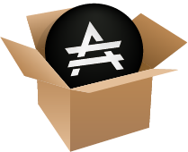

# Ara File Manager

The **Ara File Manager** is a simple desktop app that demonstrates the functionality of a complete local Ara network node and crypto token wallet.
Ara is truly decentralized; with the Ara File Manager, your machine is participating directly in peer distribution swarms and the blockchain.

The Ara File Manager lets you sell your digital content using the ARA token, and distribute your content without hosting costs.
You can buy content, and earn Ara by seeding content in a swarm of nodes that have also purchased it.

With the _code_ of the Ara File Manager, you can see how to integrate Ara into your own app or site,
enabling your users to buy, sell, own, upload, and download content, all with the secure and decentralized Ara tools.

## Quick guide

Get the code for the Ara File Mananager, build it, and run it with commands like these:

```shell
$ git clone https://github.com/arablocks/ara-file-manager
$ cd ara-file-manager
$ npm install
$ npm run start
```

For `npm install` to work, your computer must be able to build native Node modules.
If you're getting errors, head over to the [detailed guide](https://github.com/arablocks/ara-file-manager/blob/master/.github/INSTALL.md).

Package your code for macOS and Windows users with commands like these:

```shell
$ npm run build
$ APPLEID=yourid PASSWORD=yourpass npm run build
```

`npm run build` uses [electron-builder](https://www.electron.build/) to make a *dmg* on macOS and a setup *exe* on Windows.
[Code signing] and [notarization] make the Ara File Manager easy for users to install, but are not a requirement.

On macOS, electron-builder uses whatever code signing certificate is installed on your computer to sign the app.
Type your developer Apple ID and password before `npm run build`, and [electron-notarize](https://www.npmjs.com/package/electron-notarize) will [upload the app to Apple for automated analysis](https://developer.apple.com/documentation/xcode/notarizing_macos_software_before_distribution).

These two lines in [package.json](https://github.com/AraBlocks/ara-file-manager/blob/master/package.json) are about code signing on Windows:

```
"certificateFile": "../your_code_signing_certificate.pfx",
"certificatePassword": "your_exported_certificate_password"
```

You can use your certificate and password here, or remove these lines to create an unsigned *exe*, which will work just fine.

Here are some more commands useful in building and testing the app:

```
$ npm run mac
$ npm run win

$ npm run clean
$ npm run power-wash

$ npm run uninstall
```

`npm run mac` runs the *Ara File Manager.app* package that electron-builder made.
Running it this way from the command line lets you see log output and error messages.
On Windows, `npm run win` runs the built *exe*.

Between calls to `npm run build`, use `npm run clean` to delete the *dist* folder.
electron-builder creates this folder when it runs.
`npm run power-wash` is much stronger, deleting not just *dist* but also *node_modules* and *package.json*.
Use *power wash* to start over from scratch, as though you just cloned the repository and will now run `npm install`.

To absolutely, completely start over, `npm run uninstall` deletes all the paths where the Ara File Manager may have ever left files.
This includes Ara program files and settings, as well as Ara user identity, document, and wallet files on your computer.
Uninstall kills paths used by previous versions, and covers paths used on macOS and Windows.
After running *uninstall*, you'll have to enter your seed phrase to recreate your ARA wallet from the blockchain.

Make a branch, code some changes, and send us a pull request with commands like these:

```shell
$ git checkout -b your-branch-name
$ git commit -a -n -m "tasktype(file.ext): note about what you did"
$ git push origin your-branch-name
```

## Status

This project is in active developement.

## Dependencies

- [Node](https://nodejs.org/en/download/)

## Development

```shell
$ npm install --verbose --no-optional
$ npm run start [loggedin] [<DID>] [<password>]
```

Use the `--verbose` flag to get more granular feedback from npm.
The `--no-optional` flag will prevent unnecessary and heavy packages from being installed.
`npm install` downloads a large number of modules, compiles native code, and takes a minute or two to do all this.

You can follow the `start-dev` with an optional string: "`loggedin`". If you add this, you'll need to follow it with the DID you'd like to log in with, and the corresponding password to that DID. It will boot the app with you logged in already, for speedier development.

## Debug

```shell
$ DEBUG=acm* npm run start-dev //development mode
$ DEBUG=acm* ~/<path to .app>/Contents/MacOS/Ara\ File \Manager //packaged
```

All `debug` names in the project begin with `acm` followed by their path, separated by a colon. You can narrow the logs by specifying the paths.

## Metadata format

The metadata format the file manager is compatible with is the following:

```shell
{
  "fileInfo": {
    "author": "Manggo",
    "size": "500mb"
    "title": "Some content"
    "timestamp": "2018-12-12T23:59:46.314Z"
  }
}
```

## Contributing

* Cut from and make PRs to `master`
* After getting approval and merging into `master`, bump either minor or patch
  - Minor when latest version of app not compatible with older versions (ie `ara-contracts` has changed)
  - Patch for everything else
* Push tags
* Push `CHANGELOG`

- [Commit message format](https://github.com/arablocks/ara-file-manager/blob/master/.github/COMMIT_FORMAT.md)
- [Commit message examples](https://github.com/arablocks/ara-file-manager/blob/master/.github/COMMIT_FORMAT_EXAMPLES.md)
- [How to contribute](https://github.com/arablocks/ara-file-manager/blob/master/.github/CONTRIBUTING.md)

## See also

- External [link](https://goo.gl/67cqTC)

## License

LGPL-3.0
